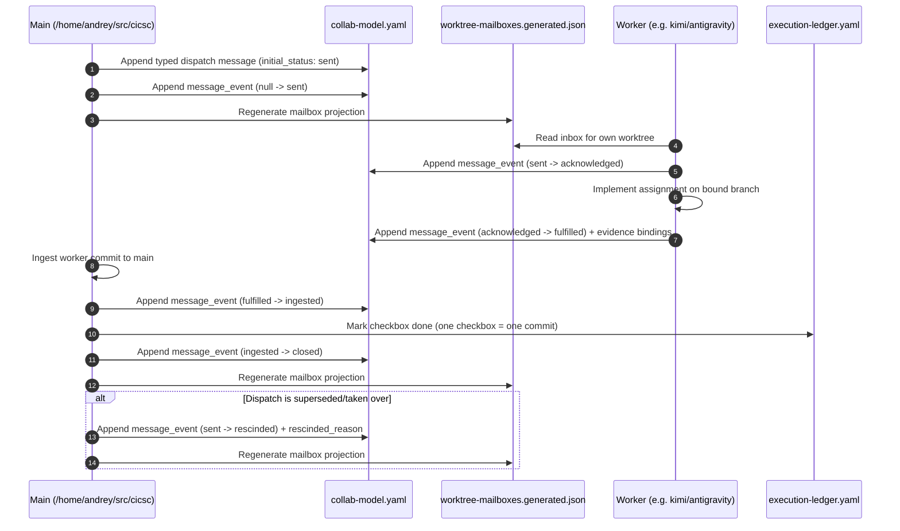

# WMCC Message-Passing Sequence

```mermaid
sequenceDiagram
    autonumber
    participant M as Main (/home/andrey/src/cicsc)
    participant C as collab-model.yaml
    participant V as worktree-mailboxes.generated.json
    participant K as Worker (e.g. kimi/antigravity)
    participant E as execution-ledger.yaml

    M->>C: Append typed dispatch message (initial_status: sent)
    M->>C: Append message_event (null -> sent)
    M->>V: Regenerate mailbox projection
    K->>V: Read inbox for own worktree
    K->>C: Append message_event (sent -> acknowledged)
    K->>K: Implement assignment on bound branch
    K->>C: Append message_event (acknowledged -> fulfilled) + evidence bindings
    M->>M: Ingest worker commit to main
    M->>C: Append message_event (fulfilled -> ingested)
    M->>E: Mark checkbox done (one checkbox = one commit)
    M->>C: Append message_event (ingested -> closed)
    M->>V: Regenerate mailbox projection

    alt Dispatch is superseded/taken over
        M->>C: Append message_event (sent -> rescinded) + rescinded_reason
        M->>V: Regenerate mailbox projection
    end
```

Source diagram (raw Mermaid):
- `docs/genesis/worktree-collab-sequence.mmd`
